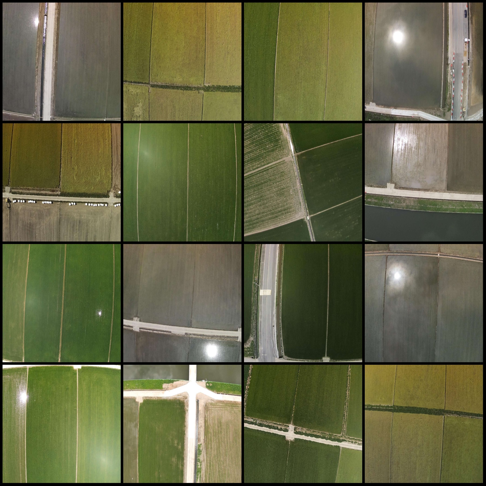
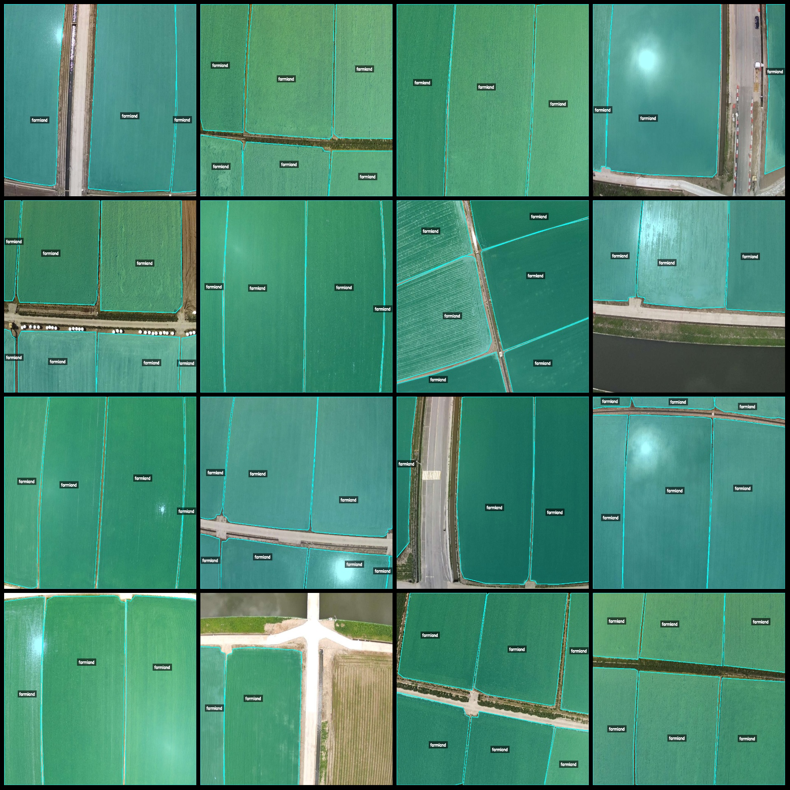
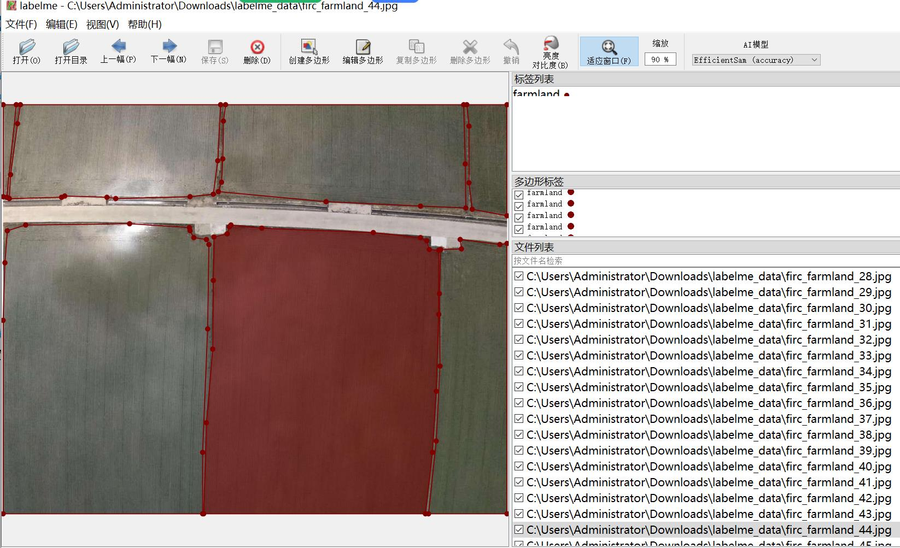

# Intelligent Agriculture Drone Perspective Cropland Area Identification and Segmentation Dataset in LabelMe Format

## Dataset Format: LabelMe format (excluding mask files, only containing jpg images and corresponding json files)

- Number of jpg files: 4972
- Number of json files: 4972
- Number of labeled categories: 1
- Labeled category name: "farmland"
- Number of boxes per category: 25430
- Total number of boxes: 25430
- Labeling tool used: labelme = 5.5.0
- Image resolution: 1024x832
- Annotation rules: Polygon drawing for each category

Special Notes: This dataset can be edited using the labelme editor, but the json dataset needs to be converted into either a Mask or Yolo format or COCO format for semantic segmentation or instance 
segmentation.

Important Reminder: This dataset does not guarantee the accuracy of the trained models or weight files.

Image Preview:

**Examples of Annotation:**

- **Randomly selected 16 images:**

**Annotation drawing results:**

**Example of editing with labelme:**

## Images

Here is a pay link on Stripe ( https://buy.stripe.com/3cs8yP7sY87d0vu9AB ). Please contact me lonlonago@foxmail.com after funding $89, and I will send you a complete data files , thank you!

